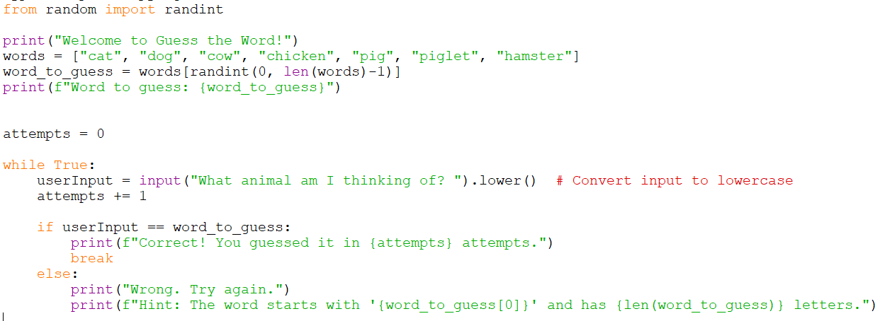

# Guess the word

*Reminder*: Do not copy paste all the code in each step. Read the instructions, some code are not meant to be rewritten but to let you know where to put the new code.

## Step 1: Set up the basic structure

In this step, we're getting ready to play a game called "Guess the Word." 

Write this starter code, run it and observe the results.

    from random import randint

    print("Welcome to Guess the Word!")
    words = ["cat", "dog", "cow", "chicken", "pig", "piglet", "hamster"]
    word_to_guess = words[randint(0, len(words)-1)]
    print(f"Word to guess: {word_to_guess}")

## Step 2: Take user input to make a guess

Now, we will get the user to make a guess. We ask the player to make a guess.

    userInput = input("What animal am I thinking of? ")

## Step 3: Check if the user guess is correct.

To check if the user guess is correct, we use the **if...else...** statement.

    if userInput == word_to_guess:
        print("Correct. I am thinking of", word_to_guess)
    else:
        print("Wrong. I was thinking of", word_to_guess)

Try and test out your code. It should give you the answer before the input. Enter the same answer, it should output "Correct...".

Then test your code again with the wrong answer. Ensure that it output "Wrong..."

## Step 4: Allow multiple attempts

The current code only allows you to have one attempt. Let's modify the code to allow the player to make multiple attempts until they guess the correct word.

To do so, we will initialise a variable named: **attempts**.

Modify the current code with these code. Take note to arrange the code in the right place.

    attempts = 0

    while True:
        userInput = input("What animal am I thinking of? ")
        attempts += 1

        if userInput == word_to_guess:
            print(f"Correct! You guessed it in {attempts} attempts.")
            break
        else:
            print("Wrong. Try again.")

## Step 5: Add a Hint

Let's add a hint to help the player.

The hint will be displayed when the player got the wrong answer.

    print(f"Hint: The word starts with '{word_to_guess[0]}' and has {len(word_to_guess)} letters.")

## Step 6: Make it case-insensitive
To make the input case-insensitive, so it doesn't matter if the player enters the word in uppercase or lowercase. We will use the .lower() method towards the input.

In the variable that has the **input** function, add the .lower() method.

    userInput = input("What animal am I thinking of? ").lower()  # Convert input to lowercase

### Final Code

## Challenges

1. Expand the word list.
2. Limit the amount of attempts the player can do. 
3. Display different types of hints after every wrong attempt. (Instead of showing the first letter as the hint, show the last letter, or the middle letter)
4. Create different word list and let the player choose which word list to do.

## Quiz

Open the quiz below and complete it.

[Quiz](https://forms.office.com/r/iDJrYjLABL)